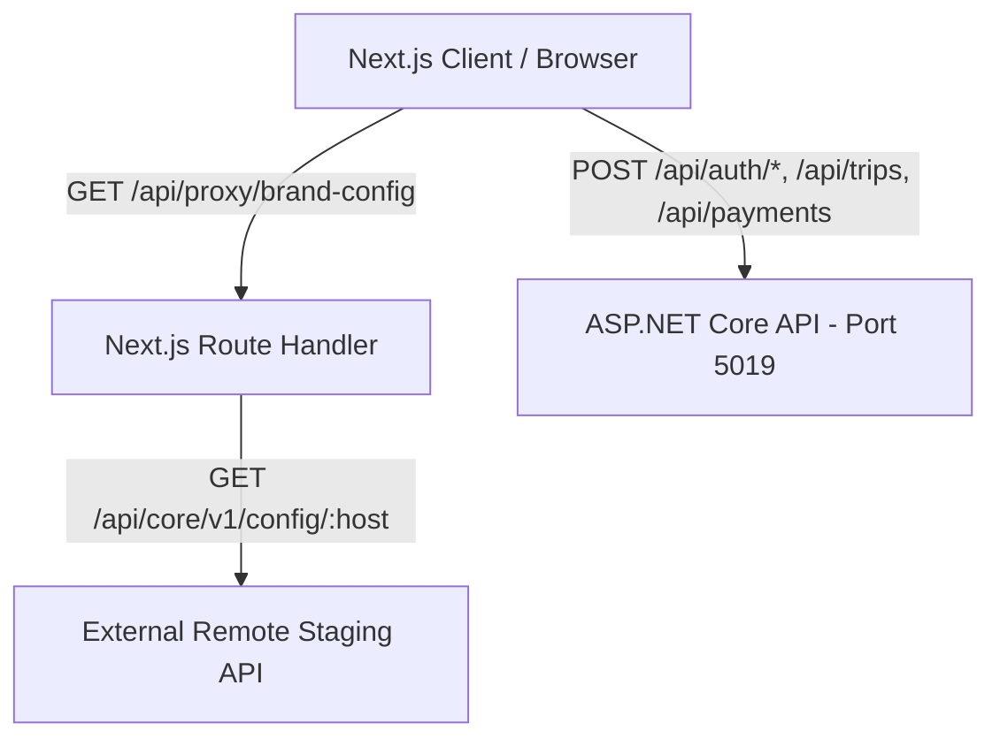

# Project Overview & Architecture Analysis: Next.js Travel App

> **Document Purpose**: Comprehensive technical overview, routing analysis, component hierarchy, API architecture, styling system, and Expo/React Native conversion assessment for the Next.js multi-brand travel application.

---

## 1. Project Summary

- **High-Level Purpose**:
  - A modern, multi-brand travel exploration and booking web platform supporting three distinct tenant brands:
    1. **GujjuTours** (`www.gujjutours.com`, key: `wanderly`): Focuses on handcrafted leisure holiday packages, family tours, Jain/vegetarian travel options, and INR pricing.
    2. **TripGoAsia** (`www.tripgoasia.com`, key: `travelpro`): Focuses on curated Asian adventures, boutique resort stays, local guides, and USD pricing.
    3. **Technoheaven** (`stagingb2b.technoheaven.com`, key: `mytravel`): Global B2B wholesale distribution platform, XML/API travel inventory, corporate hotel net rates, and USD pricing.
  - Dynamically fetches remote website configuration (logos, color palettes, typography, currency, contact details, service modules, social links) from external staging APIs based on the active domain/hostname.
  - Implements brand-isolated user authentication (JWT via ASP.NET Core backend), interactive destination browsing, reviews, custom trip/cart builder, and payments checkout.

- **Framework & Core Versions**:
  - **Next.js**: `16.3.2` (Next.js 16 App Router architecture)
  - **React**: `19.2.8` (React 19)
  - **React-DOM**: `19.2.8`
  - **Language**: TypeScript (`^5.0`) with strict typechecking
  - **Runtime**: Node.js 20+ / Edge runtime compatible

- **Styling Approach**:
  - **Tailwind CSS v4** (`tailwindcss: ^4`, `@tailwindcss/postcss: ^4`) using the modern `@import "tailwindcss";` and `@theme` block in `app/globals.css`.
  - **CSS Custom Properties (Variables)** for design tokens: `--color-ink`, `--color-teal`, `--color-sand`, `--color-coral`, `--color-gold`, `--color-cloud`.
  - **Google Fonts via `next/font/google`**: `Fraunces` (serif display), `Inter` (sans body), `IBM_Plex_Mono` (monospace accents).
  - **Dynamic Theme Injection**: Runtime branding overrides inject primary/secondary brand colors directly into root CSS variables (`document.documentElement.style.setProperty`).
  - **Rich Animations**: Custom keyframe animations (`fadeUp`, `scaleIn`, `.perforation`, `.brand-card`, reduced-motion media queries).

---

## 2. Full File Structure

The tree below highlights all core files and directories of the Next.js web application (excluding `node_modules`, `.next`, `.git`, `bin`, `obj`, and build artifacts):

```text
c:/Users/Aryan/OneDrive/Desktop/Demotravel/travel-app/
├── .env                                  # Root environment variables (API_BASE_URL, HOSTNAME, NEXT_PUBLIC_API_URL)
├── .gitignore                            # Git ignore definitions
├── AGENTS.md                             # Agent workspace guidelines
├── CLAUDE.md                             # Project assistant shortcuts
├── PROJECT_CONTEXT.md                    # Multi-brand integration and architecture history
├── PROJECT_OVERVIEW.md                   # Complete architectural analysis and conversion guide (this file)
├── eslint.config.mjs                     # ESLint configuration
├── next-env.d.ts                         # Next.js TypeScript declarations
├── next.config.ts                        # Next.js config (remote image domains, env fallbacks)
├── package.json                          # Dependencies and npm build/dev scripts
├── package-lock.json                     # NPM dependency lockfile
├── postcss.config.mjs                    # PostCSS pipeline for Tailwind v4
├── proxy.ts                              # Next.js edge middleware for hostname detection & header forwarding
├── tsconfig.json                         # TypeScript compiler configuration and path aliases (@/*)
│
├── app/                                  # Next.js App Router root directory
│   ├── favicon.ico                       # Default web favicon
│   ├── globals.css                       # Tailwind v4 theme, CSS variables, utility layers, animations
│   ├── layout.tsx                        # Root layout: SSR hostname detection, fonts, global providers
│   ├── loading.tsx                       # Global suspense fallback loader
│   ├── page.tsx                          # Multi-brand Home landing page (hero, search, modules, perks)
│   ├── about/
│   │   └── page.tsx                      # About page (brand story, explorer philosophy)
│   ├── contact/
│   │   └── page.tsx                      # Contact page with interactive inquiry submission form
│   ├── destinations/
│   │   ├── loading.tsx                   # Destinations loading skeleton
│   │   ├── page.tsx                      # Destination catalog page (filter pills, search bar, grid)
│   │   └── [id]/
│   │       ├── loading.tsx               # Destination detail skeleton loader
│   │       └── page.tsx                  # Dynamic destination details, image gallery, reviews section
│   ├── login/
│   │   └── page.tsx                      # Multi-brand user login page
│   ├── register/
│   │   └── page.tsx                      # Multi-brand user registration page
│   ├── trips/
│   │   ├── loading.tsx                   # Trips list loading skeleton
│   │   ├── page.tsx                      # Authenticated user's trips list (guarded by useRequireAuth)
│   │   ├── create/
│   │   │   ├── CreateTripClient.tsx      # Client form for trip builder (destination, dates, travelers)
│   │   │   ├── loading.tsx               # Trip create loading skeleton
│   │   │   └── page.tsx                  # Trip creation route wrapper with React Suspense
│   │   └── [id]/
│   │       ├── page.tsx                  # Dynamic trip cart & itinerary builder (flights, hotels, visa)
│   │       └── payment-success/
│   │           └── page.tsx              # Post-checkout payment status verification & receipt screen
│   └── api/
│       └── proxy/
│           └── brand-config/
│               └── route.ts              # Server-side route handler proxying remote staging config APIs
│
├── components/                           # Reusable UI and business components
│   ├── BoardingPassCard.tsx              # Boarding-pass styled ticket card with perforation aesthetics
│   ├── BrandStartup.tsx                  # Injects dynamic brand favicon into HTML document head
│   ├── CTASection.tsx                    # Call-to-action banner linking to trip creation
│   ├── DestinationCard.tsx               # Destination card displaying image, badge, price, duration
│   ├── DestinationGrid.tsx               # Responsive grid container for DestinationCards
│   ├── ExampleUsage.tsx                  # Component usage demonstration reference
│   ├── Footer.tsx                        # Global multi-brand footer with dynamic links and copyright
│   ├── Hero.tsx                          # Primary home hero section with search and badge
│   ├── Navbar.tsx                        # Main header with brand logo, nav links, currency, auth status
│   ├── PaymentButton.tsx                 # Button component invoking checkout session creation
│   ├── RemoteConfigDebugPanel.tsx        # Floating debug toolbar for switching brands at runtime
│   ├── RemoteConfigProvider.tsx          # Core brand config context: fetches, maps, caches branding
│   ├── SearchBar.tsx                     # Search input with live destination filtering
│   ├── SpecialOffers.tsx                 # Promotional discounts section
│   ├── Stats.tsx                         # Travel platform key metrics (happy travelers, destinations)
│   ├── Testimonials.tsx                  # User travel stories and quotes
│   ├── TravelStories.tsx                 # Travel inspiration blog stories section
│   ├── TripPlannerShowcase.tsx           # Step-by-step trip builder showcase
│   ├── WhyWanderly.tsx                   # Brand trust perks, 24/7 care, and guarantees
│   ├── auth/
│   │   └── AuthProvider.tsx              # Context for brand-isolated auth tokens & user profiles
│   ├── brand/
│   │   ├── BrandBooking.tsx              # Modular booking card for services
│   │   ├── BrandDestinations.tsx         # Brand-customized destination showcase
│   │   ├── BrandHero.tsx                 # Dynamic hero supporting brand-specific slogans
│   │   ├── BrandModules.tsx              # Service modules grid (Hotels, Flights, Visas, Transfers)
│   │   ├── BrandPhilosophy.tsx           # Brand mission and values section
│   │   ├── BrandShell.tsx                # Brand container wrapper with responsive gutters
│   │   ├── BrandSplash.tsx               # Brand intro splash animation
│   │   └── BrandState.tsx                # Brand-themed empty and error state cards
│   ├── home/
│   │   ├── BrandHero.tsx                 # Home hero variant
│   │   ├── MyTravelHome.tsx              # Technoheaven B2B wholesale home template
│   │   ├── TravelProHome.tsx             # TripGoAsia bespoke adventures home template
│   │   └── WanderlyHome.tsx              # GujjuTours holiday packages home template
│   ├── loading/
│   │   └── BrandLoading.tsx              # Themed spinner and shimmer loaders
│   ├── reviews/
│   │   ├── ReviewsSection.tsx            # Reviews list, rating distribution, user submissions
│   │   └── StarRating.tsx                # 5-star interactive rating component
│   ├── trips/
│   │   └── BrandTripCreate.tsx           # Trip creation form component
│   └── ui/
│       ├── Skeleton.tsx                  # Skeleton placeholders for carts and destinations
│       └── Toast.tsx                     # Toast notification provider and hook (useToast)
│
├── config/                               # Static brand identity & hostname configuration
│   ├── index.ts                          # Hostname resolution, brand mappings, active brand identities
│   ├── mytravel.ts                       # Technoheaven fallback theme, modules, copy
│   ├── travelpro.ts                      # TripGoAsia fallback theme, modules, copy
│   ├── types.ts                          # TypeScript contracts for brand configs and identities
│   └── wanderly.ts                       # GujjuTours fallback theme, modules, copy
│
├── data/
│   └── destinations.ts                   # Static destination data catalog (Bali, Santorini, Kyoto, etc.)
│
├── hooks/
│   └── useRequireAuth.ts                 # Route guard hook ensuring user is authenticated before render
│
├── lib/
│   ├── apiClient.ts                      # Application API client (auth, trips, payments, X-Brand header)
│   └── remoteConfig.ts                   # Brand config mapper, color resolution, fallback utilities
│
├── public/                               # Static public assets (SVGs, icons)
│   ├── file.svg
│   ├── globe.svg
│   ├── next.svg
│   ├── vercel.svg
│   └── window.svg
│
├── types/                                # Global TypeScript definitions
│   ├── destination.ts                    # Destination model interface
│   └── remoteConfig.ts                   # Remote staging API JSON schema definitions
│
├── TravelApp.Api/                        # Companion ASP.NET Core Backend (Port 5019)
│   └── (Controllers, DTOs, Models, Migrations, AppDbContext, Program.cs)
│
└── mobile/                               # Companion Expo Mobile Application
    └── (Expo Router tabs app aligned with web APIs)
```

---

## 3. Pages / Routes Breakdown

| Route | File Path | Type | Dynamic Params | Data Fetching & Description |
| :--- | :--- | :--- | :--- | :--- |
| `/` | `app/page.tsx` | Client (`"use client"`) | None | Multi-brand dynamic landing page. Reads `useAppConfig()`. Renders Hero, Service Modules bar (`HOTEL`, `PACKAGE`, `TOUR`, `FLIGHT`, `TRANSFER`, `VISA`), Quick Search, Popular Destinations, and perks. |
| `/about` | `app/about/page.tsx` | Server Component | None | Static editorial page detailing brand mission, explorer ethos, and platform background. |
| `/contact` | `app/contact/page.tsx` | Client (`"use client"`) | None | Customer support page. Form submits messages to `/api/contact` via `fetch`. |
| `/destinations` | `app/destinations/page.tsx` | Client (`"use client"`) | None | Catalog page. Filters `destinations` by search text and tags (`ALL`, `ADVENTURE`, `BEACH`, `CULTURE`, `NATURE`). |
| `/destinations/[id]` | `app/destinations/[id]/page.tsx` | Client (`"use client"`) | `[id]` (`params.id`) | Destination detail view. Renders image galleries, overview, pricing, `ReviewsSection`, and a "Plan Trip" button linking to `/trips/create?destinationId=...`. |
| `/login` | `app/login/page.tsx` | Client (`"use client"`) | None | User authentication screen. Resolves active `brandId` and calls `apiClient.login`. Persists brand-scoped token. |
| `/register` | `app/register/page.tsx` | Client (`"use client"`) | None | User signup form. Creates brand-scoped account via `apiClient.register`. |
| `/trips` | `app/trips/page.tsx` | Client (`"use client"`) | None | User's bookings dashboard. Gated by `useRequireAuth()`. Fetches `/api/trips` with `X-Brand` and `Bearer` token. |
| `/trips/create` | `app/trips/create/page.tsx` | Server + Client | None | Trip planner form (destination, start/end dates, travelers count, custom notes). Wrapped in React `Suspense`. |
| `/trips/[id]` | `app/trips/[id]/page.tsx` | Client (`"use client"`) | `[id]` (`params.id`) | Interactive trip cart. Gated by `useRequireAuth()`. Lists itinerary items (flights, hotels, visas), price breakdown, and checkout trigger. |
| `/trips/[id]/payment-success` | `app/trips/[id]/payment-success/page.tsx` | Client (`"use client"`) | `[id]` (`params.id`) | Post-payment callback verification. Reads `paymentId` and `status` query params, renders success/cancel notification. |
| `/api/proxy/brand-config` | `app/api/proxy/brand-config/route.ts` | Route Handler (Server) | Query: `lang`, `hostname` | `export const dynamic = "force-dynamic"`. Proxies external staging config endpoints to bypass browser CORS. |

> **Note on Data Fetching**: The application does **not** use legacy Next.js Pages Router conventions (`getServerSideProps`, `getStaticProps`, or `getStaticPaths`). Instead, it leverages the Next.js 16 App Router:
> - Root layout uses `headers()` to detect the incoming hostname on the server.
> - Feature pages are Client Components (`"use client"`) that hydrate data on mount using `useEffect` and `fetch` with client-side caching.

---

## 4. Components & Next.js Couplings

### Component Registry & Locations

| Component | Location | Usage | Next.js Specific Couplings |
| :--- | :--- | :--- | :--- |
| **`Navbar`** | `components/Navbar.tsx` | Global (`app/layout.tsx`) | `next/link` (`<Link>`), `next/navigation` (`usePathname`, `useRouter`), ``, DOM `useRef<HTMLDivElement>`. |
| **`Footer`** | `components/Footer.tsx` | Global (`app/layout.tsx`) | `next/link` (`<Link>`), HTML anchors, DOM elements. |
| **`RemoteConfigProvider`**| `components/RemoteConfigProvider.tsx`| Global (`app/layout.tsx`) | `window.localStorage`, `document.documentElement.style.setProperty`, browser `fetch`. |
| **`AuthProvider`** | `components/auth/AuthProvider.tsx` | Global (`app/layout.tsx`) | `window.localStorage`, browser `window` checks, React Context. |
| **`BrandStartup`** | `components/BrandStartup.tsx` | Global (`app/layout.tsx`) | DOM manipulation: `document.head`, `document.querySelector('link[rel="icon"]')`. |
| **`ToastProvider`** | `components/ui/Toast.tsx` | Global (`app/layout.tsx`) | DOM fixed positioning, CSS transitions, browser timers. |
| **`DestinationCard`** | `components/DestinationCard.tsx` | Destinations, Home | `next/link` (`<Link>`), `next/image` (`<Image fill sizes ...>`). |
| **`DestinationGrid`** | `components/DestinationGrid.tsx` | Destinations catalog | HTML `<div>` grid layout, renders `DestinationCard`. |
| **`SearchBar`** | `components/SearchBar.tsx` | Destinations page | Standard HTML `<input>`, browser input events. |
| **`Hero` & `BoardingPassCard`** | `components/Hero.tsx`, `BoardingPassCard.tsx` | Home, Wanderly view | CSS `.perforation` radial gradient mask, SVG flight icons. |
| **`ReviewsSection` & `StarRating`**| `components/reviews/` | Destination `[id]` | React state, HTML buttons, star icons. |
| **`BrandTripCreate`** | `components/trips/BrandTripCreate.tsx` | `/trips/create` | `next/navigation` (`useRouter`, `useSearchParams`), HTML form, inputs. |
| **`PaymentButton`** | `components/PaymentButton.tsx` | Trip cart | `window.location.href` redirect to payment gateway URL. |
| **`Skeleton`** | `components/ui/Skeleton.tsx` | Loading states | Tailwind CSS `animate-pulse` DOM divs. |
| **Home Brand Views** | `components/home/` (`WanderlyHome`, `TravelProHome`, `MyTravelHome`) | `/` (Home) | Tailored layouts with brand-specific perks, modules, and imagery. |

---

## 5. API & Fetch Logic

### 1. Two-Tier API Architecture



1. **Remote Brand Configuration API** (External Staging):
   - **Endpoints**: `https://stagingapi.<brand>.com/api/core/v1/config/:hostname?lang=en`
   - **Accessed via**: Server-side Next.js route handler (`/api/proxy/brand-config`) to eliminate CORS issues in browser development.
   - **Payload**: JSON containing `website` (name, logo, favicon, staticPath), `colors` (primary, secondary scales), `websiteContact`, `websiteModules`, `websiteCurrency`.

2. **Application Backend API** (ASP.NET Core on `http://localhost:5019`):
   - Configured via `NEXT_PUBLIC_API_URL`.
   - **Endpoints**:
     - `POST /api/auth/login` — Authenticate user credentials.
     - `POST /api/auth/register` — Register new user account.
     - `POST /api/auth/logout` — Invalidate user session.
     - `GET  /api/auth/me` — Retrieve active user profile.
     - `GET  /api/trips` — List trips for authenticated user.
     - `POST /api/trips` — Create new trip itinerary.
     - `GET  /api/trips/:id` — Retrieve trip cart with flights/hotels/visas.
     - `PUT  /api/trips/:id` — Update trip details.
     - `DELETE /api/trips/:id` — Delete trip.
     - `POST /api/payments/checkout` — Generate checkout session URL.
     - `POST /api/contact` — Submit general contact message.
   - **Headers Attached on Every Request** (`lib/apiClient.ts`):
     - `X-Brand: <brandKey>` (Mandatory tenant isolation).
     - `Authorization: Bearer <token>` (Retrieved from brand-isolated local storage).

### 2. Environment Variables

| Variable | Location Referenced | Purpose |
| :--- | :--- | :--- |
| `NEXT_PUBLIC_API_URL` | `lib/apiClient.ts`, `.env` | Base URL for the ASP.NET application API (Default: `http://localhost:5019`). |
| `HOSTNAME` / `NEXT_PUBLIC_HOSTNAME` | `next.config.ts`, `config/index.ts`, `app/api/proxy/brand-config/route.ts`, `.env` | Active brand hostname override (`www.gujjutours.com`, `www.tripgoasia.com`, `stagingb2b.technoheaven.com`). |
| `API_BASE_URL` | `app/api/proxy/brand-config/route.ts`, `.env` | Staging API target for server-side proxy route. |

### 3. Server-Side & Middleware Logic
- **`proxy.ts`** (Middleware):
  - Intercepts non-static requests, derives canonical hostname from request headers/URL, sets `x-current-hostname` request header, and strips obsolete cookies.
- **`app/api/proxy/brand-config/route.ts`**:
  - Acts as a server-side proxy with an `AbortController` timeout (12 seconds) and `cache: "no-store"` to deliver fresh tenant branding to client components.

---

## 6. Styling System

- **Framework**: Tailwind CSS v4.
- **Theme Variables**:
  ```css
  --color-ink: #16241f;        /* Deep rich charcoal */
  --color-teal: #0e5c56;       /* Primary default brand teal */
  --color-teal-dark: #0a413d;  /* Darker accent */
  --color-sand: #f6f2e9;       /* Warm background canvas */
  --color-coral: #e85c3f;      /* Vibrant alert/accent coral */
  --color-gold: #c89b3c;       /* Star rating & award gold */
  --color-cloud: #dce3de;      /* Subtle border gray */
  ```
- **Dynamic Variable Injection**:
  `RemoteConfigProvider` overrides `--color-teal` with the tenant's primary color at runtime.
- **Typography**:
  - Display: `var(--font-fraunces)`, Georgia, serif
  - Body: `var(--font-inter)`, system-ui, sans-serif
  - Mono: `var(--font-plex-mono)`, "Courier New", monospace
- **Custom Utilities**:
  - `.perforation`: Radial-gradient perforation strip simulating ticket stubs.
  - `.brand-card`: Card hover translation (`translateY(-4px)`).
  - Keyframe animations: `fadeUp`, `scaleIn`.

---

## 7. Dependencies & React Native Compatibility

| Package | Version | Purpose in Web App | Works in Expo / React Native? | Conversion Requirement |
| :--- | :--- | :--- | :--- | :--- |
| `next` | `16.3.2` | Framework, routing, SSR | ❌ **No** | Replace with `expo` and `expo-router`. |
| `react` | `19.2.8` | Core UI library | ⚠️ **Partial** | Must use React Native primitives (`View`, `Text`, `Pressable`). |
| `react-dom`| `19.2.8` | Web DOM renderer | ❌ **No** | Not used in React Native (mobile uses native bridges). |
| `tailwindcss` | `^4.0.0` | Utility CSS styling | ❌ **No** | Convert to `StyleSheet.create` or `nativewind`. |
| `@tailwindcss/postcss` | `^4.0.0` | PostCSS plugin | ❌ **No** | Remove from mobile build. |
| `next/image` | Built-in | Optimized web images | ❌ **No** | Replace with React Native `<Image>` or `expo-image`. |
| `next/link` | Built-in | Client-side routing | ❌ **No** | Replace with `expo-router` (`<Link href="...">` or `router.push`). |
| `next/navigation` | Built-in | Route hooks | ❌ **No** | Replace with `useRouter`, `useLocalSearchParams` from `expo-router`. |
| `next/font/google` | Built-in | Web font loader | ❌ **No** | Replace with `expo-font` (`useFonts`). |

---

## 8. Potential Conversion Issues for Expo / React Native

1. **HTML DOM vs. Native Components**:
   - Web code uses `div`, `section`, `article`, `header`, `footer`, `p`, `span`, `h1`-`h6`, `input`, `form`, and `button`.
   - In React Native, every element must strictly map to `<View>`, `<Text>`, `<TextInput>`, `<Pressable>`, `<ScrollView>`, or `<FlatList>`.

2. **Storage API Differences**:
   - Web code accesses `window.localStorage` synchronously.
   - React Native requires asynchronous storage: `@react-native-async-storage/async-storage` (`getItem`, `setItem`, `removeItem`).

3. **Dynamic CSS Variables & DOM Manipulation**:
   - In Next.js, `RemoteConfigProvider` alters styling using `document.documentElement.style.setProperty('--color-teal', ...)`.
   - React Native has no CSS document root. Theme colors must be passed down via React Context (`useBrandConfig()`) into `StyleSheet` objects or inline style props.

4. **SVG Asset Rendering**:
   - The Next.js app loads remote `.svg` brand logos (e.g., `gujju-logo.svg`) inside standard HTML `` tags.
   - React Native's default `<Image>` component **fails to render remote `.svg` files** on iOS and Android. Solutions:
     - Use `react-native-svg` and `react-native-svg-transformer` / `SvgUri`.
     - Provide fallback PNG assets or monogram badges.

5. **Network / Hostname Access on Physical Devices**:
   - In web development, calling `http://localhost:5019` works directly from the browser.
   - On a physical mobile device running Expo Go, `localhost` refers to the phone itself. Requests fail unless the computer's LAN IP (e.g., `http://192.168.x.x:5019`) is configured in `mobile/.env`.

6. **Next.js Server Actions & Route Handlers**:
   - The `/api/proxy/brand-config` route handler runs inside the Next.js Node server to avoid CORS.
   - In Expo, mobile apps do not run a Node server; they call the staging config API directly. Because React Native is not bound by browser CORS policies, native fetch can contact `https://stagingapi.gujjutours.com` directly without a proxy.

7. **Form Submission & Keyboard Handling**:
   - Web forms rely on `<form onSubmit={(e) => { e.preventDefault(); }}>`.
   - React Native forms require controlled inputs and `<KeyboardAvoidingView>` / `<ScrollView keyboardShouldPersistTaps="handled">` to prevent keyboard obstruction.

8. **CSS Grid & Perforation Effects**:
   - Complex CSS like `grid-template-columns: repeat(auto-fit, minmax(280px, 1fr))` and radial gradient perforation strips (`.perforation`) must be re-architected with Flexbox layouts (`flexDirection: 'row'`, `flexWrap: 'wrap'`) or dash borders in React Native.
